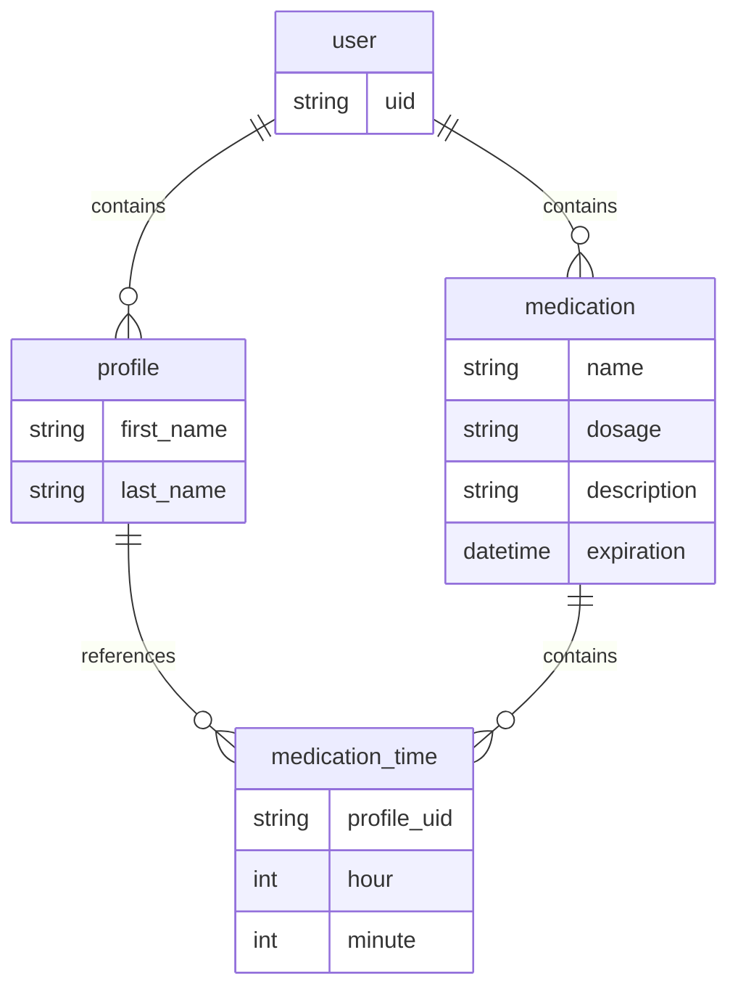

# Data structure
([mermaid extension](https://marketplace.visualstudio.com/items?itemName=bierner.markdown-mermaid) for vs code is needed )

```mermaid
erDiagram
    user ||--o{ profile : contains
    user ||--o{ medication : contains
    user {
        string uid
    }
    profile ||--o{ medication_time : references
    profile {
        string first_name
        string last_name
    }
    medication ||--o{ medication_time : contains
    medication {
        string name
        string dosage
        string description
        datetime expiration
    }
    medication_time
    medication_time {
        string profile_uid
        int hour
        int minute
    }
```